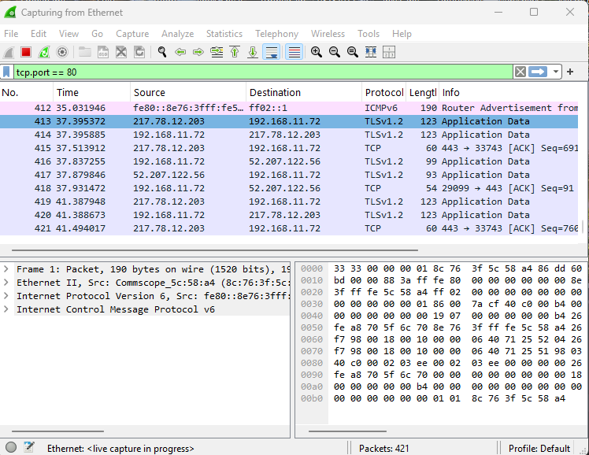
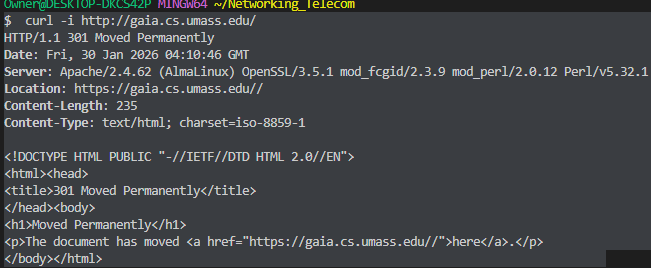
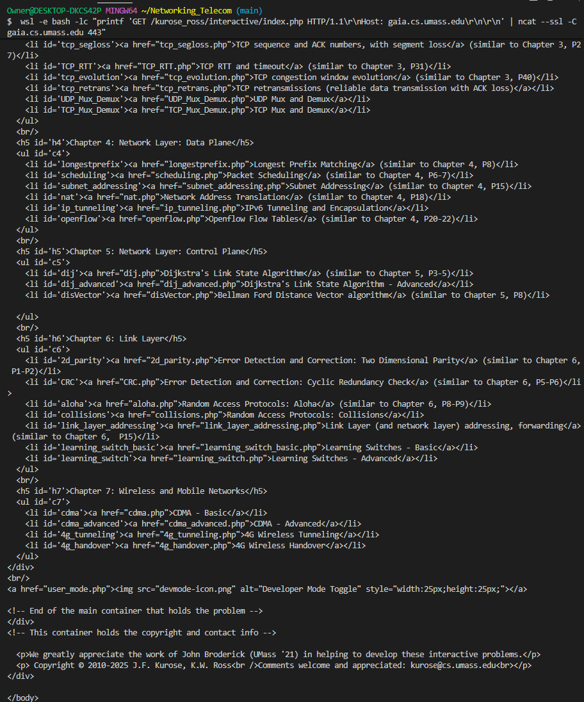
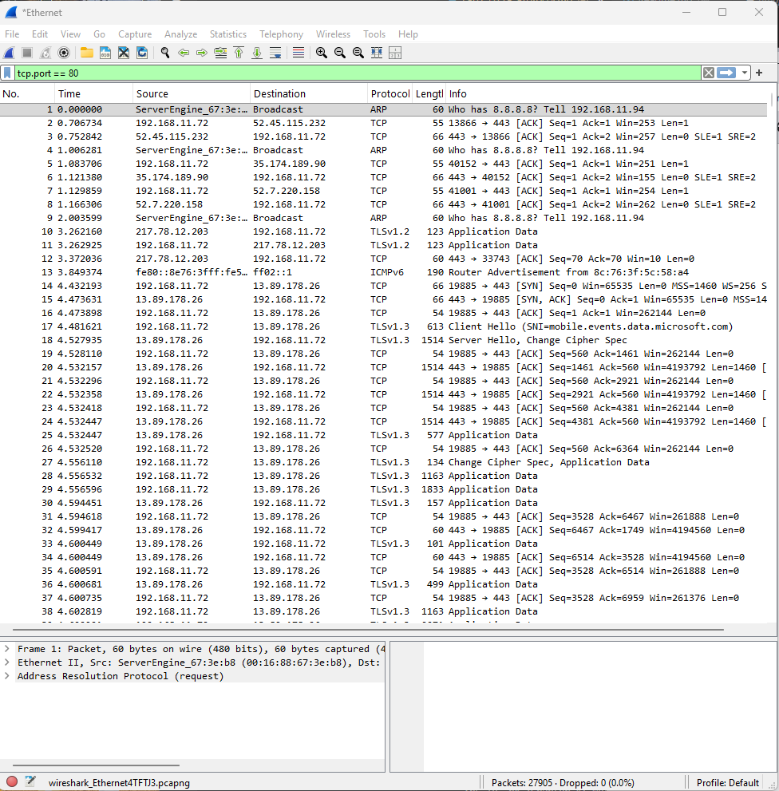
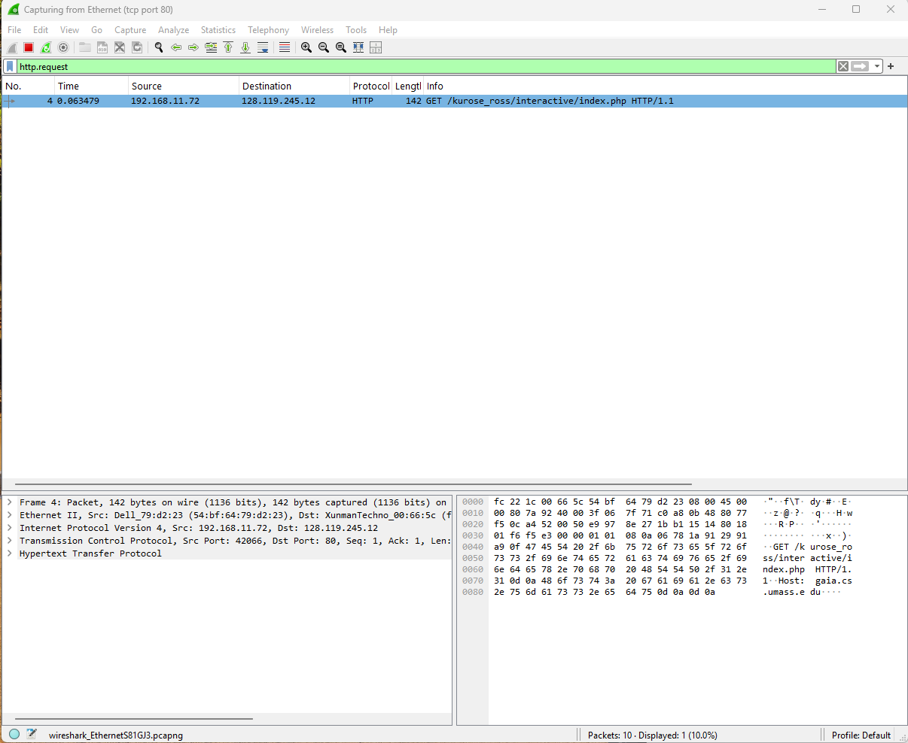
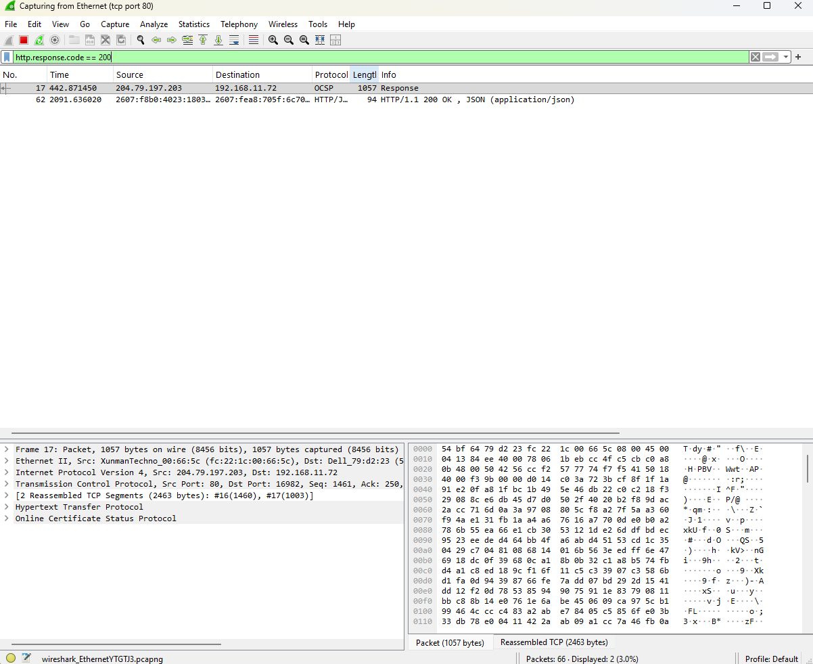
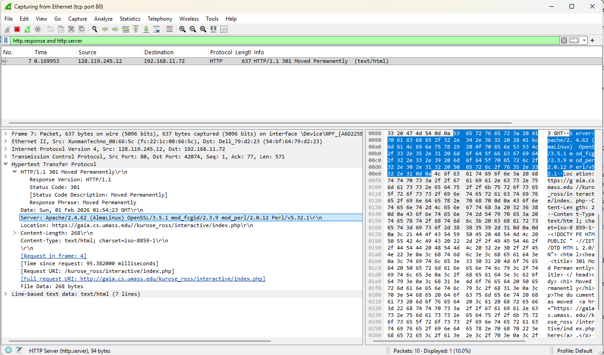

# Lab 1: Investigating HTTP with Ncat, Wireshark, & Python
**Course:** CPAN‑226 — Winter 2026
**Instructor:** Sergio Loza — Version 1.0

## Objective
Manually “speak” the HTTP protocol to a web server using ncat, capture traffic to analyze TCP/HTTP structure in Wireshark, and replicate the client functionality using Python sockets.

---

## Part 0: Pre‑Lab Setup (Install Ncat)
Before starting, you must have ncat installed. It is a powerful command‑line tool that reads and writes data across networks.

**Windows Users**
- Install Nmap, which includes ncat.
- Download the “Nmap executable installer” from https://nmap.org/download.html.
- During installation, ensure the box for **Ncat** is checked.
- Verification: Open PowerShell or CMD and type `ncat --version`.

**macOS Users**
- You likely have `nc` installed by default. Open a terminal and try `nc -h`.
- If you need the specific Nmap version (preferred), use Homebrew: `brew install nmap`.

**Linux Users**
- Ubuntu/Debian: `sudo apt install ncat` (or `nmap`).
- Fedora: `sudo dnf install nmap-ncat`.

---

## Part 1: Wireshark Preparation
We need to set up Wireshark to filter out background noise so we only see our specific traffic.
1. In Wireshark, select your active network interface (Wi‑Fi or Ethernet).
2. In the capture filter bar, enter the following to isolate web traffic: `tcp.port == 80`.
3. Click the blue shark fin icon to Start Capture.

### Evidence
## Figure: Wireshark Capture Filter (Port 80)


---

## Part 2: The Manual HTTP Request
You will now act as the web browser. Instead of clicking a link, you will type the raw protocol commands.
1. Open your terminal (CMD, PowerShell, or Terminal).
2. Connect to the server gaia.cs.umass.edu on port 80:
   - Windows (Nmap ncat): `ncat -C gaia.cs.umass.edu 80`
   - macOS/Linux: `nc -C gaia.cs.umass.edu 80` *(The -C flag ensures CRLF line endings required by HTTP.)*
3. Once the cursor sits waiting (you won’t see a “connected” message), type the following request exactly. Press Enter twice after the second line:
   - `GET /kurose_ross/interactive/index.php HTTP/1.1`
   - `Host: gaia.cs.umass.edu`
4. Observe: The server should blast back text starting with a response, maybe HTTP/1.1 200 OK, followed by headers and HTML code.

### Question 1
What was the HTTP response status code? What is its meaning? What should you do now?

### Answer
<span style="color: #1f6feb;">**301 Moved Permanently** — The requested resource has been permanently moved. The server is redirecting you to HTTPS. Follow the Location header to https://gaia.cs.umass.edu/.</span>

### Evidence
## Figure: Question 1 Terminal Output


---

5. Now try it again with this new option (SSL activated):
   - `ncat --ssl -C gaia.cs.umass.edu 443`

### Evidence
## Figure: Question 2 Terminal Output (HTTPS)


### Question 2
What was the response status code now? What is its meaning?

### Answer
<span style="color: #1f6feb;">**200 OK** — The request succeeded and returned the resource over HTTPS.</span>

---

## Part 3: Packet Dissection (Wireshark)
Let’s see what that conversation looked like on the wire.
1. Stop the Wireshark capture.
2. Locate the packets generated by your ncat command.
3. Analyze the TCP Handshake:
   - Find the first three packets (SYN, SYN‑ACK, ACK).
   - Deliverable: Screenshot this sequence. Capture the local computer time and date on the screenshot.

### Evidence: TCP Handshake
## Figure: TCP Handshake (SYN, SYN-ACK, ACK)


### Evidence: HTTP Request
## Figure: HTTP GET Packet (Expanded Headers)


**Analyze the HTTP Request:**
- Find the packet labeled GET.
- Expand **Hypertext Transfer Protocol** in the middle pane.

### Evidence: HTTP Response
## Figure: HTTP 200 Response Packet


**Analyze the HTTP Response:**
- Find the packet labeled `HTTP/1.1 200 OK`.

### Question 3
What “User‑Agent” did you send?

### Answer
<span style="color: #1f6feb;">None (no User-Agent header was sent by ncat).</span>

### Question 4
What server software is running on the remote machine (look at the Server: header)?

### Answer
<span style="color: #1f6feb;">Apache/2.4.62 (AlmaLinux) OpenSSL/3.5.1 mod_fcgid/2.3.9 mod_perl/2.0.12 Perl/v5.32.1</span>

### Evidence
## Figure: Server Header (HTTP Response)


---

## Part 4: Python Socket Client

### Evidence
## Figure: Python Client Socket Output (301)


### Python Client Output (Option 2 — HTTPS 200)
```
Connected to gaia.cs.umass.edu:443
Request sent successfully

HTTP/1.1 200 OK
Date: Sun, 01 Feb 2026 03:03:48 GMT
Server: Apache/2.4.62 (AlmaLinux) OpenSSL/3.5.1 mod_fcgid/2.3.9 mod_perl/2.0.12 Perl/v5.32.1
X-Powered-By: PHP/8.0.30
Set-Cookie: DevMode=0
Transfer-Encoding: chunked
Content-Type: text/html; charset=UTF-8

Status Line: HTTP/1.1 200 OK
Connection closed
```

### Question 5
Do you get a response status message 200? If not, what changes are needed to make it respond with a 200?

### Answer
<span style="color: #1f6feb;">No. The script is hitting HTTP on port 80 and gets a 301 redirect. To receive 200, use HTTPS (port 443 with TLS) or follow the Location header and resend the request over HTTPS.</span>
